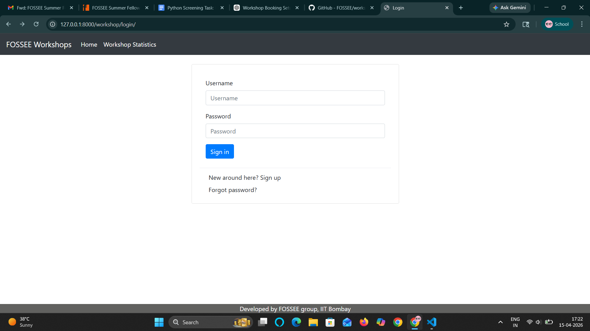
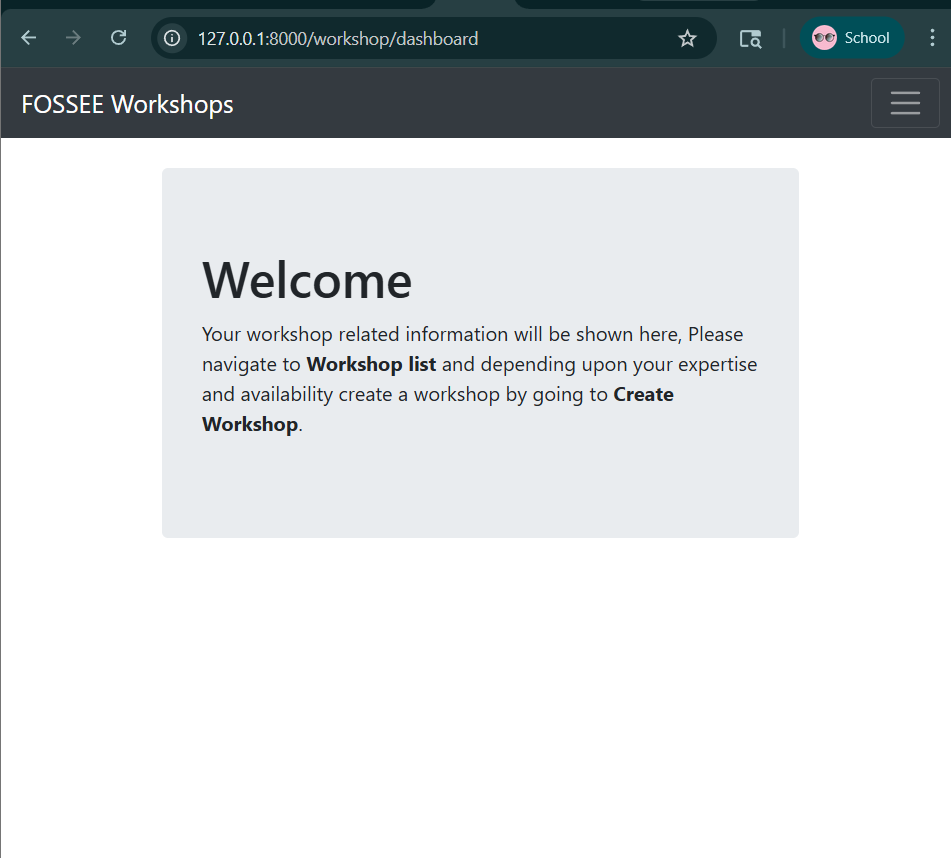

# 🎓 Workshop Booking UI/UX Redesign

A modern redesign of the FOSSEE Workshop Booking System focusing on performance, usability, accessibility, and responsive design.

---

## 🚀 Project Overview

This project improves the existing Django-based workshop booking system by redesigning the UI/UX using modern frontend practices.

### 🔥 Goals Achieved
- ✅ Modern UI design
- ✅ Fully responsive layout (mobile + desktop)
- ✅ Improved performance
- ✅ Better accessibility
- ✅ Clean and intuitive user experience
- ✅ SEO-friendly structure

---

## 🛠️ Tech Stack

### Backend
- Django (Python)
- SQLite (default DB)

### Frontend
- React (for redesign)
- HTML5, CSS3
- Bootstrap
- JavaScript

---

## 📸 Screenshots




---

## ⚙️ Setup Instructions

### 1️⃣ Clone the repository
```bash
git clone https://github.com/rashiii21/workshop-booking.git
cd workshop-booking